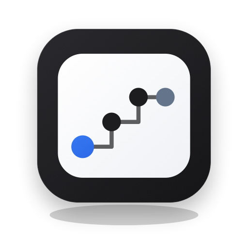
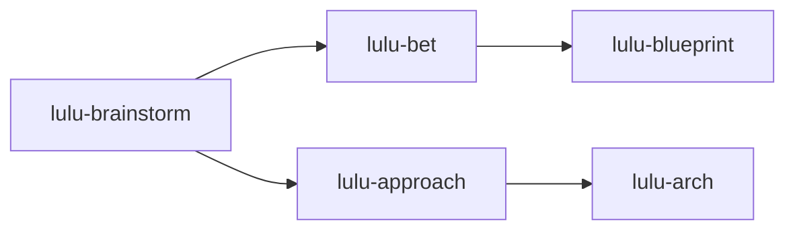
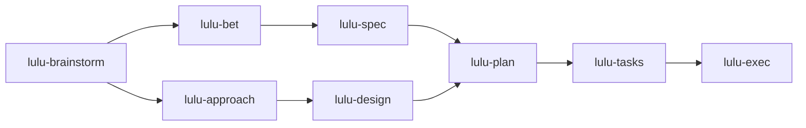

  

<h1 align="center">Lulu Workflow</h1>

<b>A staged development workflow for AI coding agents.</b>

  <a href="https://lulufoo.github.io/interview/lulu-workflow.html">Architecture map</a>
  &nbsp;
  
  &nbsp;
  

---

## Why

An agent asked to "build the feature" jumps straight to code. Lulu Workflow slows that down on purpose: it puts a named stage between each decision and the next, so product intent, technical choices, design, plan, and code each get settled and delivered before the next begins. You choose every step.

## How it works

- A **cycle** is one run of the workflow, and it is one of two types. A **topic** cycle shapes product and architecture and ends in an architecture doc. A **feature** cycle carries one feature through to code, and can reference that doc.
- A **stage** is one named step in a cycle, with one job.
- A **delivered artifact** is what a stage hands to the next one. A stage is done when it has delivered, and the next stage starts from that artifact.

## The two lines

Both lines start at `lulu-brainstorm` and split into two tracks: a product track and a technical track.

### Topic line

### Feature line

- The two tracks have no order between them. On the feature line they join at `lulu-plan`.
- `lulu-bet` is the recommended start for full-feature work. Purely technical work can start at `lulu-approach`.

## Stages

| Stage | Key | Line | What it does | Needs | Produces |
|---|---|---|---|---|---|
| [`lulu-brainstorm`](./lulu-brainstorm/SKILL.md) | — | topic, feature (entry) | Divergent thinking before a problem is defined. Surfaces your framing and tests which constraints are real | nothing | A mirror summary of what opened. No ranking |
| [`lulu-bet`](./lulu-bet/SKILL.md) | `pd` | topic, feature | Product decision | — | Product decision package |
| [`lulu-blueprint`](./lulu-blueprint/SKILL.md) | `pa` | topic | Product doc for a topic | Delivered `lulu-bet` | Product doc |
| [`lulu-spec`](./lulu-spec/SKILL.md) | `ps` | feature | Product doc for a feature | Delivered `lulu-bet` | Product doc |
| [`lulu-approach`](./lulu-approach/SKILL.md) | `td` | topic, feature | Technical decision | — | Tech decision package |
| [`lulu-arch`](./lulu-arch/SKILL.md) | `ta` | topic | Architecture doc for a topic | Delivered `lulu-approach` | Arch doc |
| [`lulu-design`](./lulu-design/SKILL.md) | `ds` | feature | Design doc for a feature | Delivered `lulu-approach` | Design doc |
| [`lulu-plan`](./lulu-plan/SKILL.md) | `t` | feature | Implementation-ready plan | Delivered `lulu-spec` and `lulu-design` | Plan doc |
| [`lulu-tasks`](./lulu-tasks/SKILL.md) | `w` | feature | Splits the plan into independently executable tasks | Delivered plan | Work order: a task-dependency list |
| [`lulu-exec`](./lulu-exec/SKILL.md) | `c` | feature | Executes the work order | Delivered work order | Delivered code and task receipts |

## Platforms

Cursor, GitHub Copilot, Claude Code, and Codex.

Session hooks and state are platform-neutral, and each platform gets its own adapter. Lulu Workflow has no dependency on other Lulu skill packs or on an issue tracker.

## Architecture map

This README covers the first layer of the [architecture map](https://lulufoo.github.io/interview/lulu-workflow.html), Workflow Collaboration. The layers beneath it are Harness Engineering, Domain Modeling, the SKILL design paradigm, and the cognition about AI collaboration that drives the design. The map covers them.

## License

[MIT](./LICENSE)
