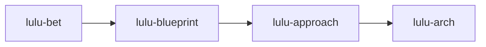
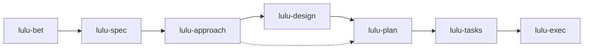

  

<h1 align="center">Lulu Workflow</h1>

<b>A staged development workflow for AI coding agents.</b>

  <a href="https://lulufoo.github.io/interview/lulu-workflow.html">Architecture map</a>
  &nbsp;
  
  &nbsp;
  

---

One line shapes product and architecture. The other carries a feature through to code. Each stage hands the next one a delivered artifact, and you choose every step.

## Why

An agent asked to "build the feature" jumps straight to code. Lulu Workflow slows that down on purpose: it puts a named stage between each decision and the next, so product intent, technical choices, design, plan, and code each get settled and delivered before the next begins.

## Two lines

Work runs in a **cycle**, and a cycle is one of two types.

- A **topic** cycle shapes product and architecture. It ends in an architecture doc, and you then start a feature cycle that references it.
- A **feature** cycle carries one feature through to code.

### Topic line

### Feature line

- `lulu-bet` is the recommended start for full-feature work. Purely technical work can start at `lulu-approach`.
- `lulu-approach` can go to `lulu-design` first, or straight to `lulu-plan` (dotted).
- [`lulu-brainstorm`](./lulu-brainstorm/SKILL.md) sits outside both lines. Use it at any point before a problem is defined.

## Stages

| Stage | Key | Line | What it does | Needs | Produces |
|---|---|---|---|---|---|
| [`lulu-brainstorm`](./lulu-brainstorm/SKILL.md) | — | any | Divergent thinking before a problem is defined. Surfaces your framing and tests which constraints are real | nothing | A mirror summary of what opened. No ranking |
| [`lulu-bet`](./lulu-bet/SKILL.md) | `pd` | topic, feature | Product decision | — | Product decision package |
| [`lulu-blueprint`](./lulu-blueprint/SKILL.md) | `pa` | topic | Product doc for a topic | Delivered `lulu-bet` | Product doc |
| [`lulu-spec`](./lulu-spec/SKILL.md) | `ps` | feature | Product doc for a feature | Delivered `lulu-bet` | Product doc |
| [`lulu-approach`](./lulu-approach/SKILL.md) | `td` | topic, feature | Technical decision | The previous stage on the line | Tech decision package |
| [`lulu-arch`](./lulu-arch/SKILL.md) | `ta` | topic | Architecture doc for a topic | Delivered `lulu-approach` | Arch doc |
| [`lulu-design`](./lulu-design/SKILL.md) | `ds` | feature | Design doc for a feature | Delivered `lulu-approach` (and `lulu-spec` for product work) | Design doc |
| [`lulu-plan`](./lulu-plan/SKILL.md) | `t` | feature | Implementation-ready plan | `lulu-spec` and `lulu-design` for product work. `lulu-design` or `lulu-approach` for technical work | Plan doc |
| [`lulu-tasks`](./lulu-tasks/SKILL.md) | `w` | feature | Splits the plan into independently executable tasks | Delivered plan | Work order: a task-dependency list |
| [`lulu-exec`](./lulu-exec/SKILL.md) | `c` | feature | Executes the work order | Delivered work order | Delivered code and task receipts |

The stages come in three kinds.

### Decide

`lulu-bet` and `lulu-approach` run a diagnostic decision, on the product side and the technical side. Each runs on the shared `decision` kernel: clarify the problem, choose a direction, diagnose along dimensions, assess risk. Each delivers a decision package that later stages build on.

### Document

`lulu-blueprint`, `lulu-spec`, `lulu-arch`, `lulu-design`, and `lulu-plan` each produce one document. Each stage prepares its own inputs and delivers through the shared `compose` engine.

### Deliver

`lulu-tasks` and `lulu-exec` turn the plan into code.

- A task is either `coding` or `action`.
- A `coding` task changes code. It runs in an isolated git worktree with TDD and a commit contract.
- An `action` task reaches a stated goal and records a receipt with evidence for each acceptance criterion.
- `lulu-exec` runs one task per sub-agent, then passes a closing gate before delivery.

## How the stages hand over

- A stage is done when it has delivered. The next stage starts from that delivered artifact.
- When a stage delivers, you are shown the stages that may follow it and you pick one. A transition that is not allowed is refused at stage entry.
- If new information invalidates an earlier stage, roll back to it. Everything downstream is invalidated and restarts from there.

## Platforms

Cursor, GitHub Copilot, Claude Code, and Codex.

Session hooks and state are platform-neutral, and each platform gets its own adapter. Lulu Workflow has no dependency on other Lulu skill packs or on an issue tracker.

## Beyond the stages

This README covers the first layer of the [architecture map](https://lulufoo.github.io/interview/lulu-workflow.html), Workflow Collaboration. The layers beneath it are Harness Engineering, Domain Modeling, the SKILL design paradigm, and the cognition about AI collaboration that drives the design. The map covers them.

## Status

Experimental and still evolving. Stage names, keys, and artifacts may change.

## License

[MIT](./LICENSE)
