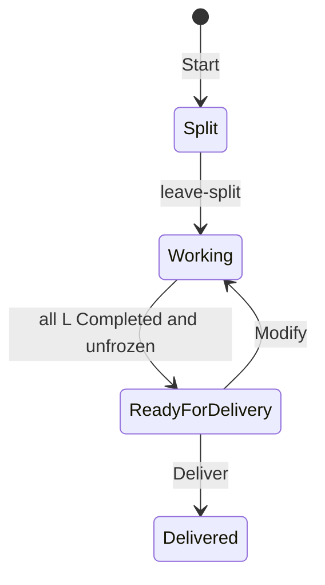

# compose

Shared compose engine for stage holders. It manages an ordered chain of L slices through delivery. Single-L execution lives in `references/l-execution.md`.

## Inputs

| Variable | Required | Source | Use |
|---|---|---|---|
| `$CYCLE_ID` | yes | Holder runtime foundation | Active cycle |
| `$PROFILE_PATH` | yes | Holder preflight | Runtime `compose-profile.json` |
| `$SCOPE_PACKAGE` | yes | Holder preflight | Normalized `scope-package.json` |

## Script Macros

Macro expansion: `{SKILL_ROOT}/_runtime.md` § Script Macros → Macro expansion. Non-zero exit → Blocking: stop, report (stderr / exit code), wait for user direction.

| Macro | Command |
|-------|---------|
| `$START_COMPOSE` | `python3 "$SKILL_ROOT/compose/scripts/core/start.py" --project-root "$(pwd)" --cycle-id "$CYCLE_ID" --profile-path "$PROFILE_PATH" --scope-package "$SCOPE_PACKAGE"` |
| `$SESSION_INFO` | `python3 "$SKILL_ROOT/compose/scripts/core/session_info.py" --cycle-id "$CYCLE_ID" --project-root "$(pwd)" --view <view>` |
| `$SESSION_CONTROL` | `python3 "$SKILL_ROOT/compose/scripts/core/session_control.py" --cycle-id "$CYCLE_ID" --project-root "$(pwd)" <subcommand>` |
| `$L_SHELL` | `python3 "$SKILL_ROOT/compose/scripts/core/l_shell_control.py" --cycle-id "$CYCLE_ID" --project-root "$(pwd)" <subcommand>` |
| `$AGENDA_CTL` | `python3 "$SKILL_ROOT/agenda/scripts/agenda_control.py" <subcommand> --project-root "$(pwd)" --cycle-id "$CYCLE_ID" [args...]` |

Subcommands and stdout: script module docstrings or `--help`.

L-execution macros are defined in `{SKILL_ROOT}/compose/references/l-execution.md`. Load that file before using them.

## Lifecycle

Route only from `$SESSION_INFO` / `$L_SHELL` stdout. Do not compute the next L by hand.

## Entry

### Start

Run `$START_COMPOSE`. On failure → Blocking.

**Done:** `$CURRENT_STATE=Split`.

### Bind context

Run `$SESSION_INFO --view session`, then bind:

| Cite | JSON field | Use |
|------|------------|-----|
| `$REVISION_DIR` | `revision_dir` | revision-scoped tools |
| `$DEMAND_MANIFEST` | `demand_manifest` | Delivery demand atomization; skip when null |
| `$CURRENT_STATE` | `workflow_state.current_state` | Outer routing |
| `$L_VIEW` | `l_view` | order, focus, next_actions |

## Split

**Session state:** `Split`. The L chain is already published.

1. Run `$SESSION_CONTROL leave-split`. On failure → Blocking.
2. From stdout `node_ids` and `focus`: tell the user it is an ordered chain of N L; focus = `focus`.
3. Continue with ## Working.

**Done:** `$CURRENT_STATE=Working`.

## Working

**Session state:** `Working`.

Loop: run `$L_SHELL status` and follow `next_actions`. On inner failure → Blocking; do not advance focus.

### Principles

- **Status governs routing.** Follow `$L_SHELL status.next_actions`; never derive legal actions from the ledger.
- **One focus at a time.** Work only on the current unfrozen L; return to Working when it reaches `Completed`.
- **Advance only to the direct successor.** Move from a `Completed` focus only to its unfrozen `Lx+1`; never skip an L.
- **Backtrack freezes the reached suffix.** Move focus to a completed predecessor in `FreeEdit`; freeze every reached successor while preserving its state and document.
- **Align before unfreezing.** Unfreeze the direct successor only when it still aligns with the completed, unfrozen prefix; unfreezing moves focus to it.
- **Ready means settled.** Leave `Working` only when every L is `Completed` and unfrozen.

### Current focus

- **Execute.** Load `{SKILL_ROOT}/compose/references/l-execution.md` and follow it for the current focus. When that L is `Completed`, return to Working.

- **Reopen.** Load `{SKILL_ROOT}/compose/references/l-execution.md` and follow **Reopen**.

### Move forward

- **Advance.** Run `$L_SHELL advance`. No confirm. On `alignment_required` → **Align and unfreeze**. On `next_action=ready-for-delivery` → **Ready for delivery**.

- **Align and unfreeze.** Read-only: review whether the frozen successor still holds given the completed prefix. If yes, run `$L_SHELL unfreeze --expected-fingerprint <stdout fingerprint> --confirm`.

### Revise prefix

- **Backtrack.** Run `$L_SHELL backtrack --target Lx --confirm`. Then load `{SKILL_ROOT}/compose/references/l-execution.md` and continue from **FreeEdit**.

### Observe

- **View.** Run `$L_SHELL view --target Lx`. Allowed in any session macrostate. Zero writes.

### Exit

- **Ready for delivery.** Confirm leaving Working, then `$SESSION_CONTROL ready-for-delivery`. On failure → Blocking.

## ReadyForDelivery

Ask: Deliver or Modify.

- Deliver → ## Delivery.
- Modify → `$SESSION_CONTROL return-to-working --confirm`. Then ## Working. Preview is not required.

## Delivery

1. Run `$SESSION_INFO --view delivery-preview`. On failure → Blocking. Show the preview; full compose document only if asked.
2. Wait for explicit delivery confirmation.
3. **Demand manifest (only when `$DEMAND_MANIFEST` is present):** enumerate delivered demands per `$DEMAND_MANIFEST.unit_rule`, then `$SESSION_CONTROL write-demand-manifest --units-json '<JSON array>'`. Skip when `$DEMAND_MANIFEST` is null. On failure → Blocking.
4. Run `$SESSION_CONTROL deliver --confirm`. On failure → Blocking (including open stage-agenda blockers — resolve via `$AGENDA_CTL` then retry).
5. Run `$SESSION_INFO --view stage-transitions`. On non-zero exit → Blocking. Prompt next stages when present.

Stage-agenda items live under the revision dir; orchestration: `{SKILL_ROOT}/agenda/SKILL.md`.

## Reference

| Document | When |
|----------|------|
| `{SKILL_ROOT}/compose/references/l-execution.md` | Execute, Reopen, Backtrack |
| `{SKILL_ROOT}/eval/SKILL.md` | Loaded from l-execution Evaluating |
| `{SKILL_ROOT}/agenda/SKILL.md` | Delivery blockers |
