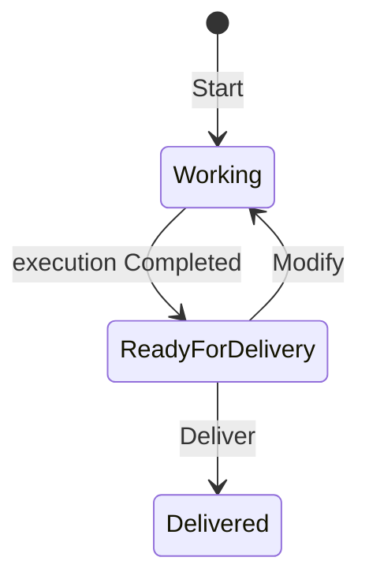

# compose

Shared compose engine for stage holders. It takes one input document, runs one
execution, and delivers one document. Step execution lives in
`references/execution.md`.

## Inputs

| Variable | Required | Source | Use |
|---|---|---|---|
| `$CYCLE_ID` | yes | Holder runtime foundation | Active cycle |
| `$PROFILE_PATH` | yes | Holder preflight | Runtime `compose-profile.json` |
| `$SCOPE_PACKAGE` | yes | Holder preflight | Normalized `scope-package.json` |

## Script Macros

Macro expansion: `{SKILL_ROOT}/_runtime.md` § Script Macros → Macro expansion. Non-zero exit → Blocking: stop, report (stderr / exit code), wait for user direction.

| Macro | Command |
|-------|---------|
| `$START_COMPOSE` | `python3 "$SKILL_ROOT/compose/scripts/session/start.py" --project-root "$(pwd)" --cycle-id "$CYCLE_ID" --profile-path "$PROFILE_PATH" --scope-package "$SCOPE_PACKAGE"` |
| `$SESSION_INFO` | `python3 "$SKILL_ROOT/compose/scripts/session/session_info.py" --cycle-id "$CYCLE_ID" --project-root "$(pwd)" --view <view>` |
| `$SESSION_CONTROL` | `python3 "$SKILL_ROOT/compose/scripts/session/session_control.py" --cycle-id "$CYCLE_ID" --project-root "$(pwd)" <subcommand>` |

Subcommands and stdout: script module docstrings or `--help`.

Execution macros are defined in `{SKILL_ROOT}/compose/references/execution.md`. Load that file before using them.

## Lifecycle

Route only from `$SESSION_INFO` stdout. Do not invent the next step.

## Entry

### Start

Run `$START_COMPOSE`. Load `{SKILL_ROOT}/compose/references/compose-ontology.md` once.

### Bind context

Run `$SESSION_INFO --view session`, then bind:

| Cite | JSON field | Use |
|------|------------|-----|
| `$REVISION_DIR` | `revision_dir` | revision-scoped tools |
| `$DEMAND_MANIFEST` | `demand_manifest` | Delivery demand atomization; skip when null |
| `$CURRENT_STATE` | `workflow_state.current_state` | Outer routing |
| `$STEP_STATE` | `execution.state` | Step routing |

**Done:** `$CURRENT_STATE=Working`.

## Working

**Session state:** `Working`.

Load `{SKILL_ROOT}/compose/references/execution.md` and follow it.

**Done:** `$STEP_STATE=Completed` → ## ReadyForDelivery.

## ReadyForDelivery

Ask: Deliver or Modify.

- Deliver → ## Delivery.
- Modify → `$SESSION_CONTROL return-to-working --confirm`. Then ## Working. Preview is not required.

## Delivery

1. Run `$SESSION_INFO --view delivery-preview`. On failure → Blocking. Show the preview; full compose document only if asked.
2. Wait for explicit delivery confirmation.
3. **Demand manifest (only when `$DEMAND_MANIFEST` is present):** enumerate delivered demands per `$DEMAND_MANIFEST.unit_rule`, then `$SESSION_CONTROL write-demand-manifest --units-json '<JSON array>'`. Skip when `$DEMAND_MANIFEST` is null. On failure → Blocking.
4. Run `$SESSION_CONTROL deliver --confirm`. On failure → Blocking (including leftover `agenda.json` blockers).
5. Run `$SESSION_INFO --view stage-transitions`. On non-zero exit → Blocking. Prompt next stages when present.

## Reference

| Document | When |
|----------|------|
| `{SKILL_ROOT}/compose/references/compose-ontology.md` | Start, once per session |
| `{SKILL_ROOT}/compose/references/execution.md` | Working |
| `{SKILL_ROOT}/eval/SKILL.md` | Loaded from execution Evaluating |
