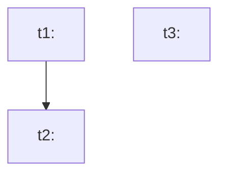

# Task List Template — work-order

> **Usage**: Each `r{N}/task-list.md` follows this template. It is the work-order index and dependency graph.

---

## File header frontmatter

```yaml
---
version: 1
work_order_round: 1       # number corresponding to r{N}
tech_ref: <absolute path to tech-doc>
total_tasks: 0
---
```

---

## Section 1: Task List

| task_id | Title | Target File | Dependencies | Kind | TDD Exempt |
|---------|-------|-------------|--------------|------|------------|
| t1 | <task title> | `path/to/file.ext` | — | coding | No |
| t2 | <task title> | `path/to/file.ext` | t1 | coding | No |
| t3 | <task title> | `path/to/file.ext` | — | verify | No |

> **Split principles**:
> - `coding`: group by test boundary, not by file. If the task changes functions, it changes 1–3. Deleting one module file is one change. Unchanged functions do not count. Pure UI / pure structural changes with no logic branches may set `tdd_exempt: true`.
> - `verify`: one stated check. Do not split it by function count.

---

## Section 2: Dependency Graph



> **Rules**: The dependency graph must not contain cycles. Execution order follows topological sort.

---

## Section 3: Exclusions

> List changes from the tech-doc that are **deliberately not included in this work order**, and state the reason.
> Exclusions are the exemption list for W1 Direction 1 (Coverage check); they will not be evaluated as "missing".

| tech-doc change point | Exclusion reason |
|---|---|
| — | — |
