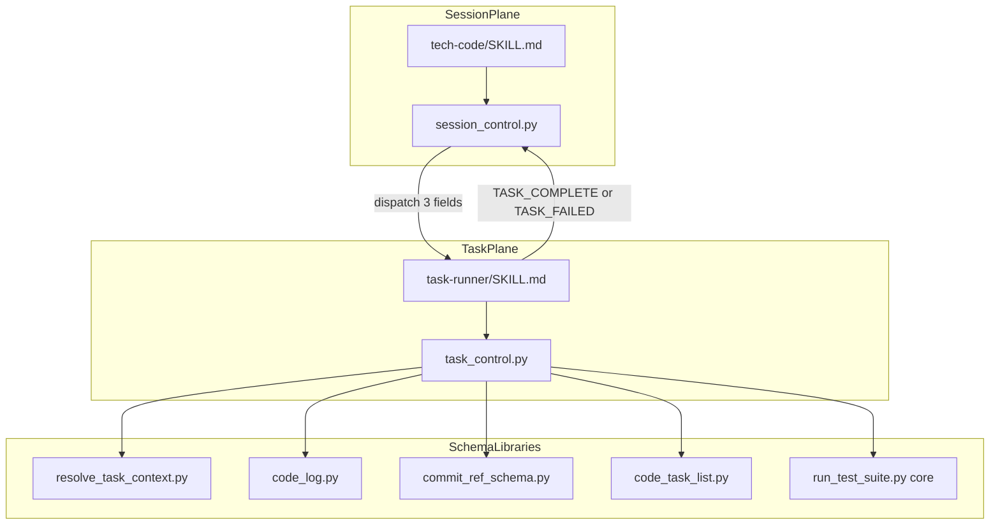

# tech-code Dual Control Plane — Architecture Note

## Theme

**Dual Control Plane + Mechanical/Creative Split**

- **Session plane** (`tech-code/SKILL.md` + `session_control.py`): orchestrates task loop, pointer, closing.
- **Task plane** (`task-runner/SKILL.md` + `task_control.py`): executes one TDD task; scripts own mechanical side effects.

## Contracts

| Contract | Fields |
|----------|--------|
| Dispatch (parent → sub-agent) | `task_id`, `cycle_dir` (abs), `project_root` (abs) |
| `$CTX` (`resolve-context` stdout) | resolve fields + `tdd_exempt: bool`, `branch: str` (per-task worktree) |

`model` selection is out of P0 scope (not in `$CTX`).

## Principles

1. **Mechanical → scripts, creative → Agent** — log / test / commit / checkbox via `task_control`; WriteTests / WriteImpl / Refactor stay Agent.
2. **Schema owns artifacts** — `commit-ref.md`, `code-log.md`, `code-task-list.md` written by libraries, not Agent prose.
3. **Minimal dispatch handoff** — parent passes coordinates only; Task plane bootstraps via `resolve-context`.

## Non-goals (P0)

- `model` in dispatch or `$CTX`
- `error-log.md` schema
- `transition-whitelist.json` enforcement
- Changes to `check-recovery`, `get-pointer`, `confirm-task-ready`, `advance-pointer`, `deliver`, `start.py`, `prepare.py`

## Decisions

| Topic | P0 decision |
|-------|-------------|
| `tdd_exempt` | task-runner skips Refactor only; full Red/Green/Refactor shortcut is follow-up |
| `tdd_exempt` precedence | task.md frontmatter wins; else `[tdd_exempt]` on code-task-list line |
| `TASK_COMPLETE` sha | Use `final_commit` from commit-ref |
